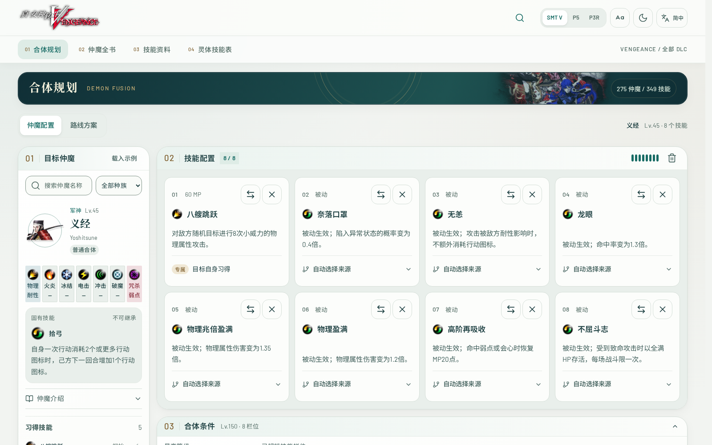

# smtvv-planer | 真女5复仇合体图鉴

《Shin Megami Tensei V: Vengeance》非官方资料与合体路线工具。支持三套主题、五种语言、仲魔与灵体图鉴、最多八技能规划，以及「综合最优」「合体次数最少」「费用最低」三种经过规则回放校验的路线。包含完整网站资源，默认在自己的机器上计算，无需 AI API、外部计算节点或维护者的服务。

## 页面截图



从[页面截图与功能介绍](docs/SHOWCASE.md)查看合体路线、仲魔全书、技能资料、灵体技能表、三类详情页及管理后台。截图取自仓库的本地版本；后台使用隔离测试数据。

## 本地运行

需要 Linux / WSL、Python 3.10+ 和 g++。Ubuntu / Debian 可用 `sudo apt-get install python3 g++` 安装运行依赖。

```sh
git clone https://github.com/zc12120/smtvv-planer.git
cd smtvv-planer
python3 launch.py
```

浏览器打开 `http://localhost:8765`，首次计算自动编译 C++17 引擎。Windows 可在 WSL 安装依赖后双击 `start.bat`。本地模式只监听回环地址，无需登录。

## 一条命令部署 HTTPS 网站

准备一台 Linux 服务器，安装 Git、Python 3.10+、Docker Engine 与 Docker Compose v2（支持 `up --wait` 的版本）。当前用户需有 Docker 使用权限。将自己的域名 A/AAAA 记录指向服务器，开放 TCP 80、443，并确认这两个端口未被其他服务使用。没有 IPv6 的服务器不要添加 AAAA 记录。首次签发建议使用直接解析。

```sh
git clone https://github.com/zc12120/smtvv-planer.git
cd smtvv-planer
python3 scripts/deploy.py https://planner.example.com
```

**将 `https://planner.example.com` 换成自己的域名。** 脚本会生成独立账号与密钥，构建应用并启动认证、网关和 Caddy；Caddy 自动申请及续期 HTTPS 证书。证书签发需要域名正确解析且公网能访问服务器。初次启动可能需要数分钟，容器启动成功不等于公网证书已签发。

- 网站：`https://你的域名/`
- 后台：`https://你的域名/admin/`
- 登录信息：本机 `runtime/credentials.txt`，可用 `cat runtime/credentials.txt` 自行查看；不要上传或转发该文件。
- 默认要求登录，管理员可在后台开放前台匿名访问，后台仍需认证。

首次 Docker 部署请使用新的克隆目录；本地运行会产生自己的 `runtime/site` 状态，不要与容器初始化混用。同一域名重复运行命令会保留账号、密钥及持久卷。遇到已有配置不完整或域名不符会停止，不会重新初始化。不要在已有部署上切换部署模式；迁移前先备份并阅读 [部署说明](docs/DEPLOYMENT.md)。

已有 Nginx、1Panel 等 HTTPS 反向代理时：

```sh
python3 scripts/deploy.py https://planner.example.com --behind-proxy
```

该模式不启动 Caddy，由现有 HTTPS 代理转发到 `127.0.0.1:8088` 并保留原始 `Host`。如果使用 CDN，该主机名下所有路径都应绕过缓存，以保证认证正确执行。

查看状态和日志：

```sh
docker compose -f compose.yaml -f compose.https.yaml ps
docker compose -f compose.yaml -f compose.https.yaml logs --tail 50 https
```

使用 `--behind-proxy` 时，运行 `docker compose ps` 即可。更新前先按部署说明备份，再执行 `git pull --ff-only`、`python3 scripts/upgrade_runtime.py`，最后重新运行部署命令。删除持久卷会丢失账号和状态，不要在普通更新时执行 `down -v`。

## 功能与计算范围

- SMT V、P5、P3 Reload 三套外观，深浅主题与大字号。
- 简体中文、English、日本語、繁體中文、한국어。
- 仲魔、技能、灵体资料，属性耐性、技能来源与等级要求。
- 自定义召唤价格、DLC 与材料限制、步骤定位、路线导出和计算中刷新恢复。
- 默认按需计算综合方案，其余目标点击后计算；重复配置可复用结果。
- 后台提供访问控制、维护、公告、密码修改、会话管理与任务管理。

费用只计起始材料的召唤价；练级成本、库存数量、临时全书操作等未完整模拟。综合方案假定灵体已拥有且免费。「已校验」表示程序校验技能、等级、材料与费用，不等于游戏全量实测。账号共用计算队列，适合个人或可信小组使用。

可选远程计算配置见 [独立节点说明](docs/DISTRIBUTED-COMPUTE.md)，单机部署无需配置该功能。

## 开发与验证

```sh
python3 -m venv .venv
.venv/bin/python -m pip install -r requirements-auth.txt
.venv/bin/python -m unittest discover -s tests -v
npm ci
npx playwright install --with-deps chromium
```

仓库提供 [GitHub Actions 示例](docs/github-actions.example.yml)，覆盖 Python 回归、网页加载、Docker 构建、认证配置与部署重复执行；如需启用，将其复制为 `.github/workflows/ci.yml` 并使用具有工作流写入权限的凭据提交。浏览器测试可按 `package.json` 中的脚本运行。需要写入账号或站点状态的测试只用于隔离测试环境。

## 文档与许可

- [部署、升级、备份与恢复](docs/DEPLOYMENT.md)
- [资源说明](docs/ASSETS.md) · [多语言](docs/I18N.md) · [界面设计](docs/DESIGN.md)
- [纯合体搜索](OPTIMAL_ROUTES.md) · [灵体联合搜索](MIXED_ROUTES.md) · [中文译注](TRANSLATION_NOTES.md)
- [安全说明](SECURITY.md) · [第三方许可](THIRD_PARTY.md)

代码采用 MIT；计算基础数据来自 [aqiu384/megaten-fusion-tool](https://github.com/aqiu384/megaten-fusion-tool)，固定提交 `e93dd1c87ca453de8fae8165bdbef220732feabc`，采用 Unlicense。字体和图标保留各自许可。

游戏名称、美术、头像和官方原文属于 ATLUS / SEGA 等权利人，不适用 MIT 或计算数据的 Unlicense。本项目与 ATLUS / SEGA 无隶属关系。
