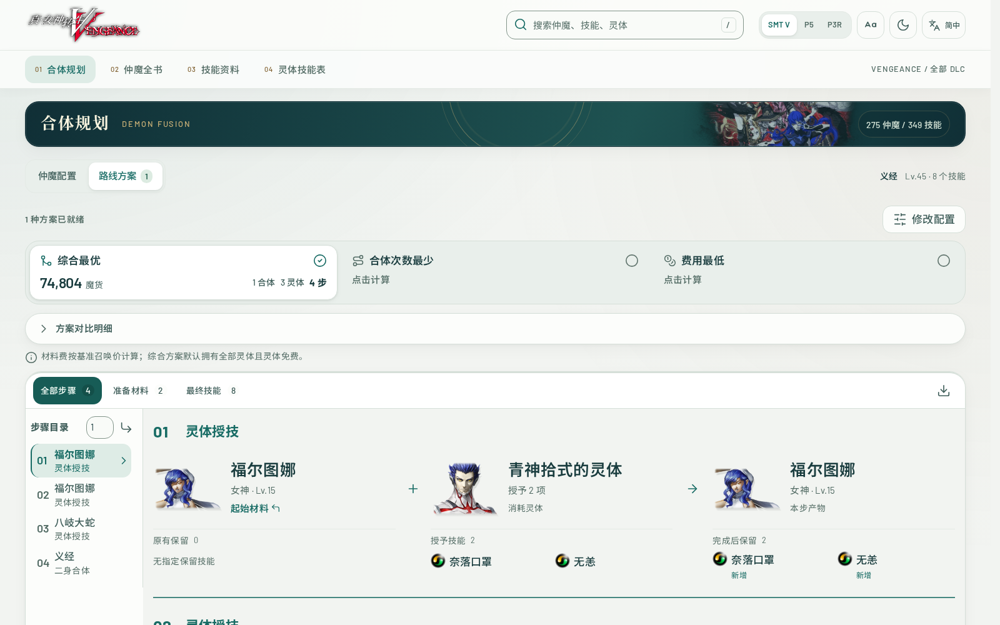
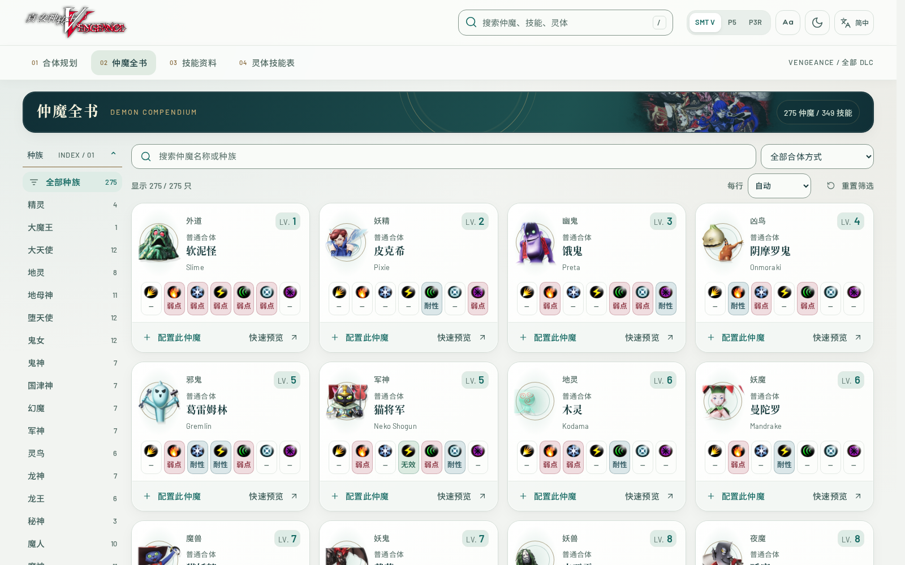
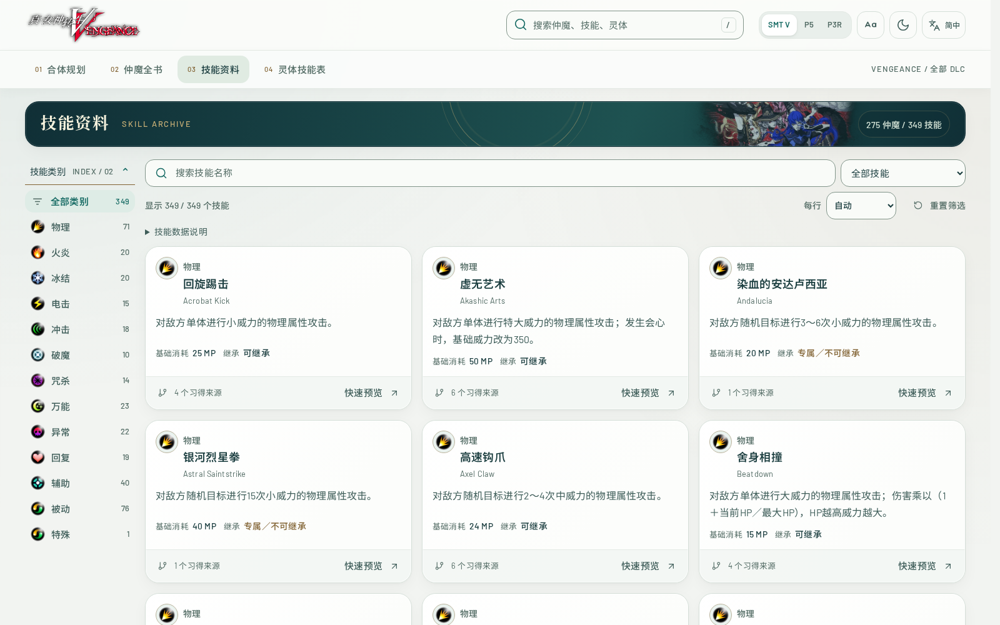
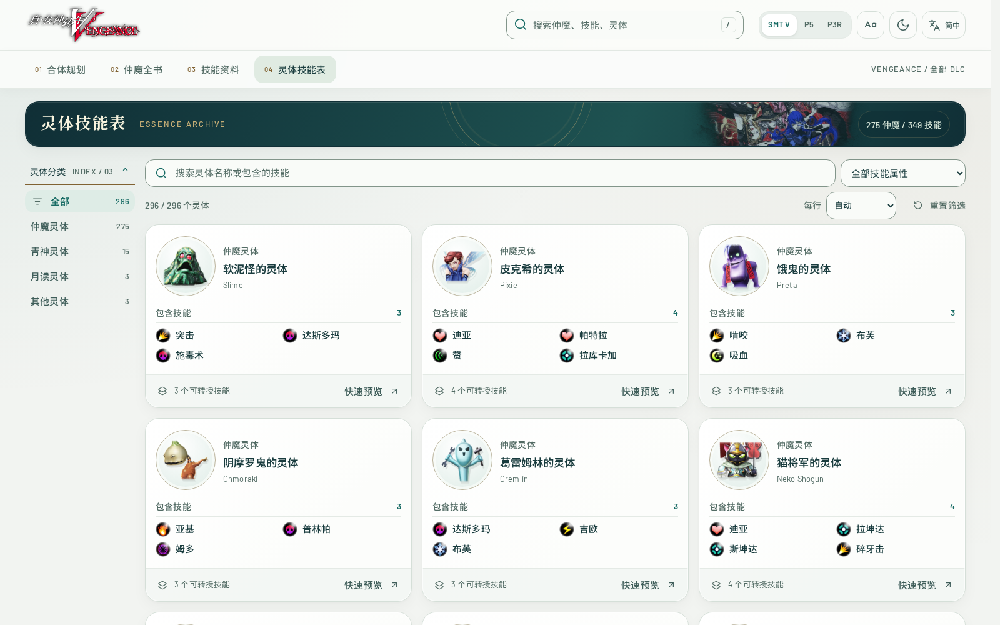
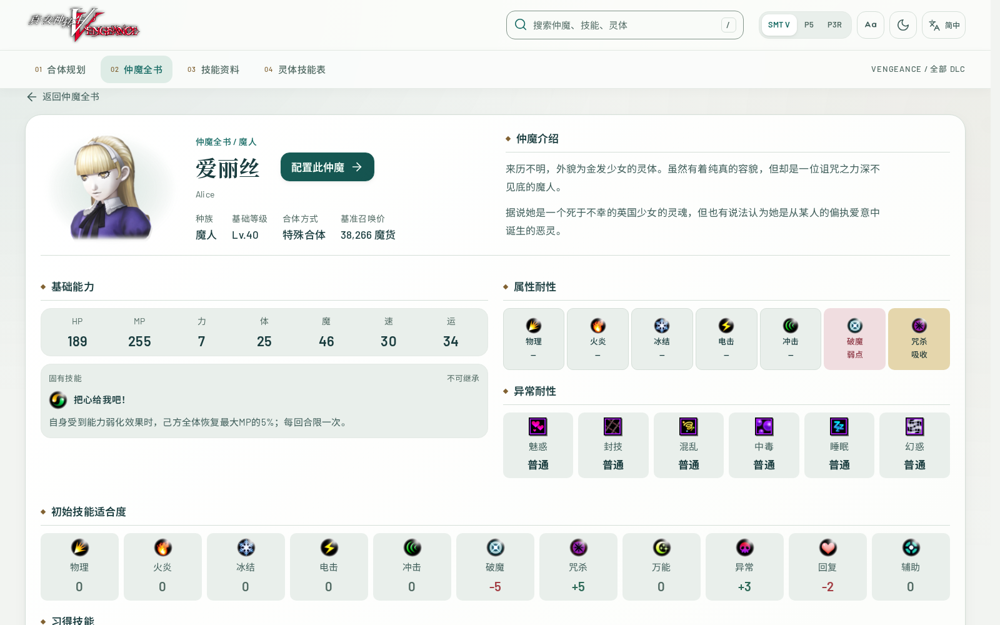
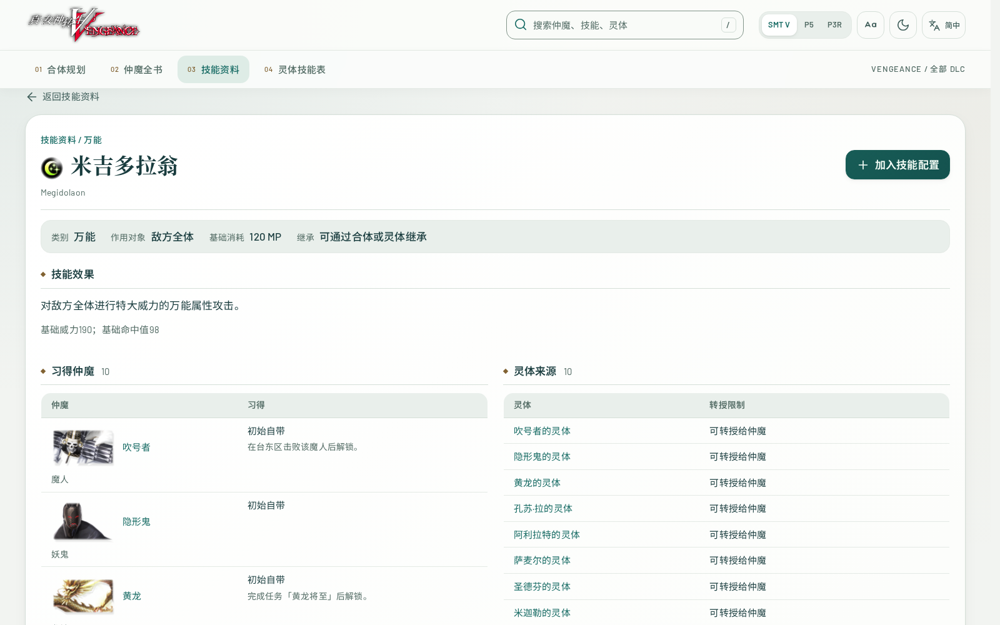
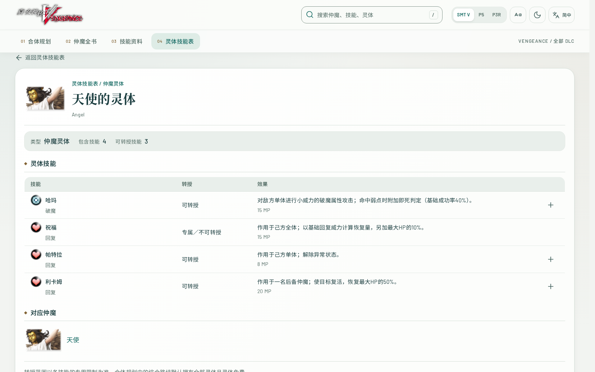
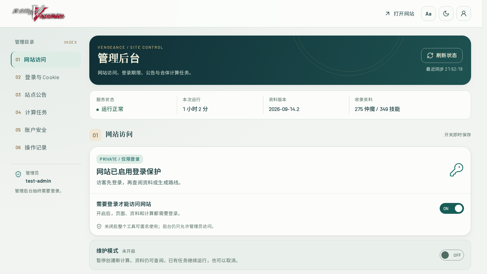

# 页面截图与功能介绍

以下截图取自本仓库的本地版本，采用简体中文、SMT V 外观和桌面尺寸。路线图展示一次真实计算；管理后台使用隔离测试数据，不包含线上账号或站点记录。

## 合体配置

选择目标仲魔和最多八个最终技能，按需要调整等级、DLC、可用材料与召唤价。图中以义经为目标，配置八个技能；技能来源可在生成路线前单独选择。

## 路线方案

生成路线后查看材料、费用、合体与灵体授技步骤。截图中的综合方案经过规则回放校验；合体次数最少和费用最低方案可按需计算，并可切换比较或导出路线。

## 仲魔全书

按种族、名称和合体方式查找仲魔。列表直接展示头像、等级与属性耐性；可预览资料，也可将仲魔带入合体规划。

## 技能资料

按技能类别、名称和继承条件筛选。卡片展示效果、基础消耗与来源数量，便于比较技能并找到适合规划的候选项。

## 灵体技能表

按灵体类别、技能属性或名称查找。每张卡片列出所含技能及可转授数量，可进一步检查转授限制。

## 仲魔详情

以爱丽丝为例，详情页汇集介绍、基础能力、属性与异常耐性、技能适合度，以及下方的习得技能和合体信息。可以直接将当前仲魔设为规划目标。

## 技能详情

以米吉多拉翁为例，详情页列出效果、作用对象、基础消耗、继承限制，以及习得仲魔和灵体来源。可从此处把技能加入当前配置。

## 灵体详情

以天使的灵体为例，逐项显示技能效果和能否转授，并关联对应仲魔。可转授技能可直接加入规划配置。

## 管理后台

管理员可管理访问要求、会话期限、维护模式、公告、计算任务和账户安全。截图中的账号、状态与运行时间均为隔离测试数据。
